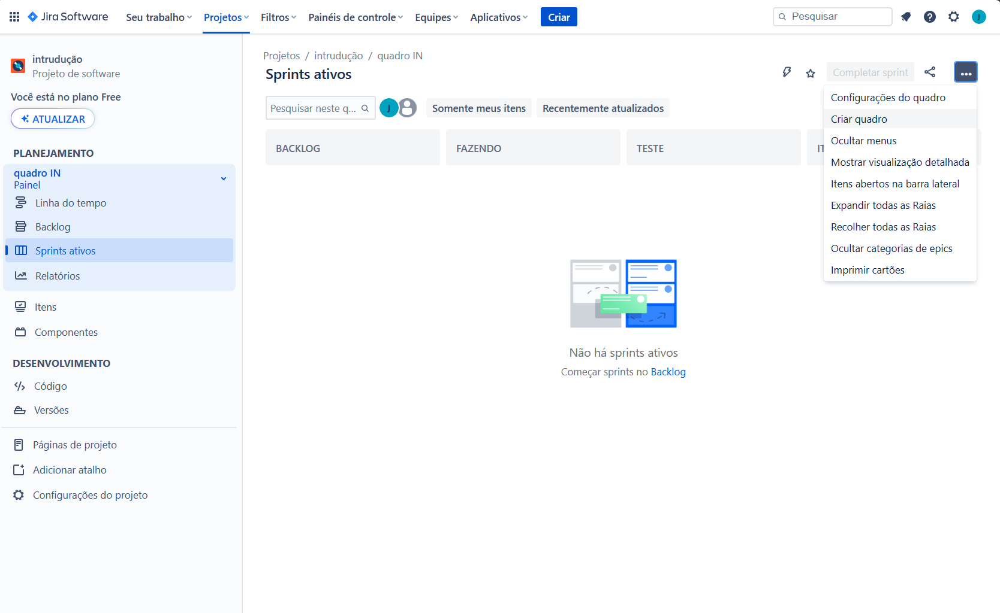
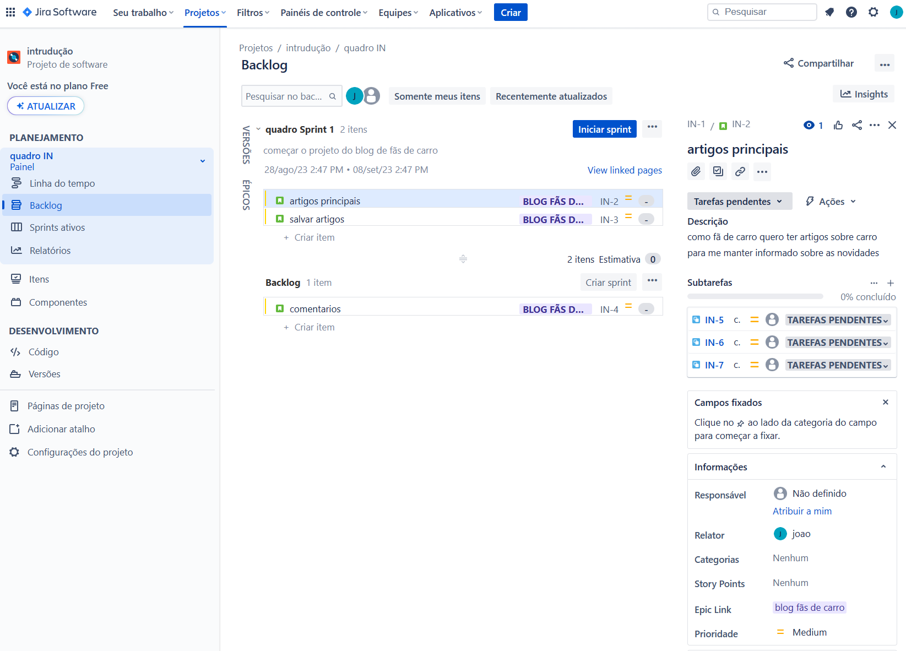

## Edição de quadros

## Criando itens
- epico
    - forma correta de criar um épico é atravez da linha do tempo/roteiro 
- historia
    - para criar as historias é so clicar no '+' dentro do épico

- tarefa
    - para criar tarefa vinculada a historia é so clicar na historia no menu que abre na direita e adicionar uma subtarefa
